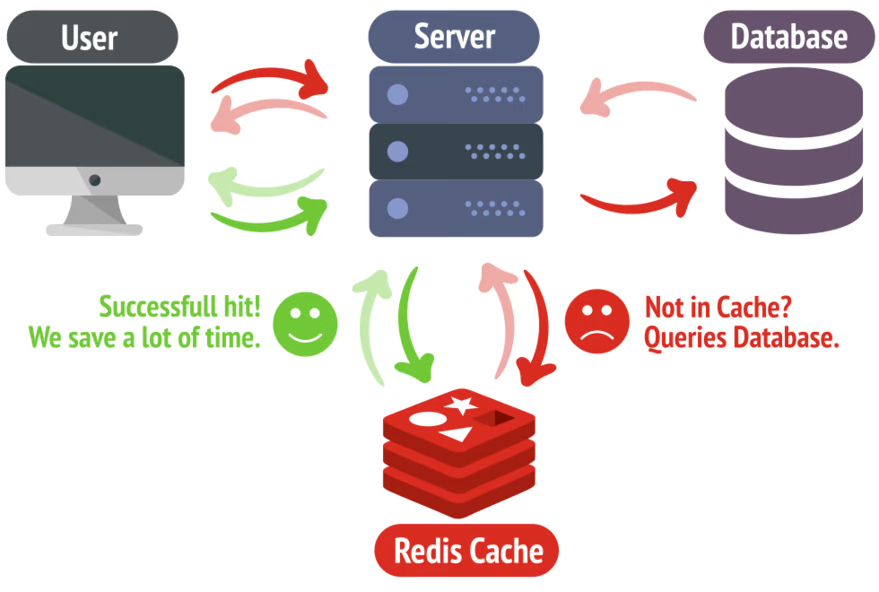

# Redis as a cache with node.js

This is a simple example of how to use Redis as a cache with node.js.



## Dependencies

- redis
  docker container: docker run --name my-redis-container -p 6379:6379 -d redis redis-server --appendonly yes
- axios
- express

## Demo

Import the dependencies and create an express server app:

```js
import express from "express";
import axios from "axios";
import { createClient } from "redis"; //https://www.npmjs.com/package/redis

const app = express();
```

Create a redis client:

```js
const client = createClient();

client.on("error", (err) => {
  console.log("Redis Client Error " + err);
});

await client.connect().then(() => {
  console.log("Connected to Redis");
});
```

If you have a cloud redis instance, you can connect to it using the following:

```js
const client = redis.createClient({
  socket: {
    host: <HOST>,
    port: <PORT>,
  },
  password: <PASSWORD>,
});
```

Create a cached endpoint:

```js
app.get("/photos", async (req, res) => {
  //first read from cache - redis database
  const photos = await client.get("photos");
  if (photos) res.send(photos);
  //if not in cache, fetch from api and store in cache
  else {
    const { data } = await axios.get(
      "https://jsonplaceholder.typicode.com/photos"
    );

    await client.set("photos", JSON.stringify(data));
    res.json(data);
  }
});
```

Run the app:

```
docker-compose up
```

Open the browser and go to http://localhost:3000/photos

First time, it will fetch from the API and store in cache. Subsequent requests will be served from the cache.

User redisinsight gui to view the data in the redis database.
